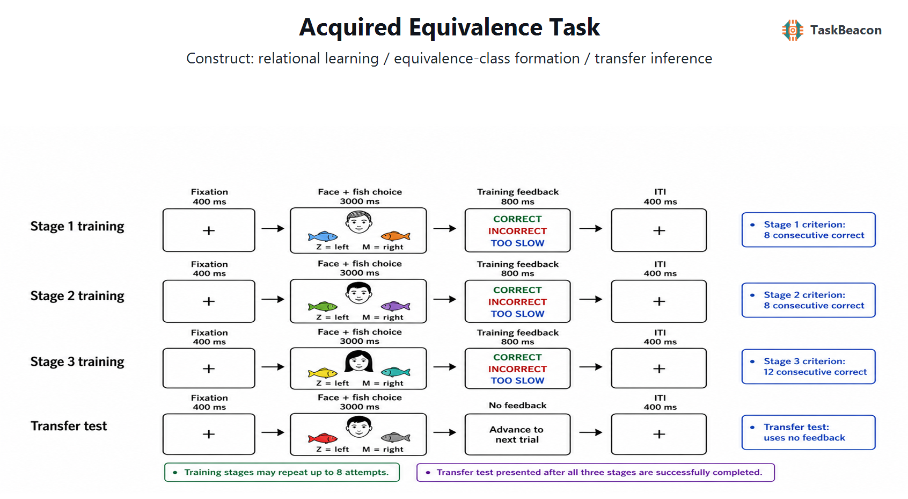

# 获得性等价范式：由共同结果学习到关系迁移的认知与神经机制

学习系统需要在保留具体事件信息的同时，从具有共同结果的经验中形成可迁移的关系知识。获得性等价（acquired equivalence）范式将这一问题操作化为：两个知觉上不同的先行刺激若反复指向同一结果，个体是否会把其中一个刺激后来获得的新关系迁移到另一个刺激。其关键证据来自未直接训练配对上的选择，而非已学配对的再认。该设计因而能够在同一任务内区分反馈驱动的关联习得、已学关系提取与跨刺激泛化，并检验共同结果究竟改变了刺激表征，还是仅在测试时支持策略性推断（Hall, 1996; Meeter et al., 2009）。

## 1. 范式提出与理论背景

获得性等价源于动物辨别学习中“共同结果使线索获得功能相似性”的发现。Honey 和 Hall（1989）表明，先前共享结果的线索会促进后续泛化；Hall（1996）进一步提出，线索呈现可激活与其关联的刺激表征，由此改变之后的学习。该传统强调等价性由学习史获得，而非由外观相似性预先给定。人类任务中的新配对选择也可能由测试时策略性推断产生；Meeter 等人（2009）以随后关联记忆中的系统性混淆表明，等价训练还会改变刺激的记忆编码，而不只是产生一次性的选择策略。

Myers 等人（2003）建立的 Rutgers 获得性等价测验（Rutgers Acquired Equivalence Test, RAET），亦称面孔—鱼任务（Face–Fish Task），把上述原则转化为分阶段的反馈学习。该任务原用于比较海马系统与基底节相关学习的可分离贡献：帕金森病患者在反馈习得上较困难，而存在海马萎缩的非痴呆老年人在已学配对保持相对完整时，对新配对的迁移受损（Myers et al., 2003）。这一双重模式支持阶段相关的系统分工，但不能据此把某一行为指标视为单一脑区的专属测量。

RAET 还促成了获得性等价研究从训练后单一迁移检验转向“习得—提取—泛化”剖面分析。共同结果关系在训练中逐步建立，测试则把直接经历过的旧配对与结构上可推得的新配对交错呈现。旧配对成绩为迁移解释提供了同时期的记忆控制：若旧配对也受损，新配对错误可能来自遗忘、注意波动或反应规则混淆；只有在旧配对保持充分时，新配对的选择差异才较明确地指向关系灵活使用。这种内部控制是该范式相对于单纯反馈分类任务的主要方法学价值（Myers et al., 2003; Bódi et al., 2009）。

## 2. 任务逻辑、流程与核心指标

经典面孔—鱼版本使用四个先行刺激 A1、A2、B1、B2 与四个结果刺激 X1、X2、Y1、Y2。塑形阶段先学习 A1→X1 与 B1→Y1；等价训练加入 A2→X1 与 B2→Y1，使 A1/A2、B1/B2 分别因共同结果而成为候选等价类；新结果阶段再教 A1→X2 与 B1→Y2。无反馈测试同时呈现已训练配对和关键的新配对 A2→X2、B2→Y2。后两类反应若高于机会水平，且不能由直接训练解释，构成获得性等价迁移（Myers et al., 2003; Meeter et al., 2009）。

单个试次通常呈现一张面孔和左右两个鱼选项，参与者通过按键选择其认为与面孔关联的鱼；训练阶段提供正确/错误反馈，测试阶段取消反馈。鱼的左右位置需平衡，以避免空间反应与结果身份混淆。经典实现采用达标学习，故主要因变量宜分阶段报告：习得期错误数或达标试次数反映反馈学习效率；测试中旧配对错误率反映已学关系提取；新配对的正确率或等价一致选择率反映迁移；反应时可补充区分快速提取与费时推断（de Araujo Sanchez & Zeithamova, 2023）。若只报告总体准确率，习得、保持和泛化三种过程将被混合。

阶段化训练同时带来暴露量不均的问题。达到学习标准较慢的个体接触同一配对更多，可能在测试时因额外练习获益，也可能因疲劳受损；固定试次数版本则降低暴露量差异，却会让基础关联尚未掌握的参与者进入迁移测试。研究者应根据目标在达标设计与固定长度设计间选择：机制研究可优先确保基础关系已掌握，个体差异研究则需把达标试次数或训练错误数纳入模型。无论采用哪一种方案，新配对成绩都应以旧配对保持和机会水平为参照，并保留首次测试反应，防止无反馈探针的重复呈现逐渐诱发新的测试内学习。

测试表现并不唯一对应“整合表征”。一种解释认为，共同结果使相关事件在编码时整合，因而新关系能够自动迁移；另一种解释是个体在测试时检索彼此分离的配对，再按共同结果进行即时推断。近年的操控研究显示，检索条件可以显著改变未训练配对表现，且部分数据更支持测试时推断（Houser et al., 2024）。因此，新配对正确率应表述为等价一致迁移，而不应未经附加的来源记忆、反应时或过程操控便断言已形成统一表征。

## 3. 行为与神经科学证据

### 3.1 关系整合、提取与泛化

获得性等价效应具有较好的群体水平可重复性，但其幅度取决于刺激和并行认知负荷。等价训练会增加同类面孔在随后关联记忆中的混淆，这支持共同结果改变了记忆编码；该变化更符合关联中介，而非单纯提高某些知觉特征权重（Meeter et al., 2009）。物理相似性可促进泛化，也可能增加来源混淆（Bowman et al., 2021）。概念相关刺激同样提高间接配对推断，却伴随对相似诱饵的更多错误再认，说明泛化收益可能以细节精确性下降为代价（Melega & Sheldon, 2023）。

工作记忆是迁移表现的重要条件变量。Balter 和 Raymond（2023）在被试内设计中发现，转移测试期间维持空间工作记忆负荷会降低迁移表现。这一结果提示测试成绩包含对当前检索资源的需求，并非只反映训练期形成的长期关系表征。刺激可言语化程度也会改变任务难度：复杂、易命名的图形优于特征受限的几何刺激，差异主要见于提取和迁移（Eördegh et al., 2022; Tót et al., 2025）。因此，不同版本间若改变刺激语义、感觉通道或反馈安排，原始分数不宜直接互换。

这些结果共同限定了“等价类形成”的行为判据。等价一致反应可以由编码期重叠事件整合、测试时链式检索、显性规则运用或这些过程的组合产生。de Araujo Sanchez 和 Zeithamova（2023）汇总五个数据集后发现，总体泛化倾向可靠但数值较小，且按需推断的证据强于自发整合；反应较快的泛化者更易出现错误记忆。因而，正确率与反应时的联合分布、来源判断以及训练阶段的记忆再激活指标，比单一迁移比例更能约束过程解释。

### 3.2 fMRI 与 EEG 所揭示的阶段机制

任务特异的神经心理与功能磁共振成像（functional magnetic resonance imaging, fMRI）证据较一致地指向海马系统对关系灵活使用的贡献。Preston 等人（2004）发现，海马活动与从已学关系生成新反应相关；Shohamy 和 Wagner（2008）进一步显示，重叠事件学习后期的海马—中脑活动增强可预测之后的泛化。该结果支持编码期整合，但 fMRI 的相关性及空间分布不能证明海马单独产生迁移。基底节相关反馈学习与海马相关关系编码可能并行协作，计算模型也表明两套系统的交互能够产生临床群体中不同的习得—迁移剖面（Moustafa et al., 2010）。

脑电图（electroencephalography, EEG）为感觉引导的等价学习提供了时间—频率层面的补充。Puszta 等人（2019）比较视觉与视听 RAET，观察到任务阶段相关的频谱功率与跨频耦合变化，视听条件下部分神经振荡效应更强，但这些变化未简单映射为行为优势。这说明 EEG 适于刻画刺激加工和学习状态的动态变化，头皮信号却不足以单独定位海马或基底节来源。现有 EEG 文献的任务版本和刺激通道差异较大，尚不足以建立可用于个体诊断的稳定生物标志物。

## 4. 发展与临床应用

RAET 的阶段分解使其常用于考察发育、衰老及神经精神疾病中的选择性困难。3—52 岁横断研究显示，习得、已学关系提取和泛化具有不同的年龄变化轨迹，儿童期表现逐步提高，成年后并非所有成分都保持相同水平（Braunitzer et al., 2017）。该结果说明年龄常模必须按任务阶段建立，横断差异不能替代纵向发展证据。

感觉通道扩展是另一条方法发展路线。视觉、听觉及视听版本沿用共同结果与无反馈迁移的结构，旨在区分特定感觉加工困难与跨模态关系学习。EEG 研究表明视听版本可改变振荡动力学，但行为优势并不与神经效应一一对应（Puszta et al., 2019）；后续刺激复杂度研究进一步说明，可命名性和语义内容可能比“单模态或多模态”本身更有解释力（Eördegh et al., 2022; Tót et al., 2025）。跨版本应用必须同时控制通道、复杂度和语义信息，不能把任一版本称为无条件等价的替代测验。

临床研究展示了范式的敏感性，也揭示其非特异性。精神分裂症患者可表现为迁移受损而基础配对学习相对保留，但药物、症状和一般认知均可能影响反馈学习（Kéri et al., 2005）。轻度阿尔茨海默病患者在习得期已有轻微困难，迁移缺陷更为显著（Bódi et al., 2009）。这些群体差异与海马—纹状体系统受累相符，却不能把单次任务表现直接用于病因定位或个体诊断；视觉辨别、工作记忆、执行控制和用药状态均需作为替代解释评估。

## 5. 测量效度与解释边界

该范式的构念效度来自操作上的分离：旧配对与新配对在同一无反馈测试中比较，可以把直接保持与关系迁移区分开。然而，迁移分数仍受训练掌握程度制约；未充分学会基础配对时，新配对错误不能归因于泛化缺陷。达标标准、最大训练次数、测试探针数及旧/新试次比例还会改变分数分布和天花板效应。研究设计应预注册学习者纳入标准，同时报告旧配对和新配对的准确率、错误数与反应时。

目前针对标准 RAET 的跨会话重测信度证据有限，已有研究更多证明群体差异与机制效应，而非稳定的个体排序。少量关键迁移试次尤其容易造成离散分数和低精度。刺激复杂度、概念相关性、物理相似性与并行工作记忆负荷均能系统改变结果（Bowman et al., 2021; Balter & Raymond, 2023; Melega & Sheldon, 2023; Tót et al., 2025）。因此，跨研究比较应统一版本参数，临床研究还需独立样本验证区分效度；现有证据支持其作为关系学习研究范式，不足以支持单独作为临床筛查工具。

## 6. TaskBeacon 中的任务实现

### 6.1 任务资源与访问入口

| 资源 | ID | 用途 | 地址 |
|---|---|---|---|
| 完整行为实验源码 | T000053 | PsychoPy/PsyFlow 本地研究实施 | [GitHub](https://github.com/TaskBeacon/T000053-acquired-equivalence-task) |
| 浏览器伴随版源码 | H000053 | 静态行为型浏览器预览；每个训练阶段仅运行一次 | [GitHub](https://github.com/TaskBeacon/H000053-acquired-equivalence-task) |

两个仓库均标记为行为采集、草案版本。现有一手项目元数据未提供可验证的公开直接运行地址。H000053 保留面孔—鱼选择、分阶段训练、迁移探针、反馈与汇总，但其静态任务图不执行 T000053 的达标后重复控制，故不能替代完整本地实施。

### 6.2 实现流程与关键参数

TaskBeacon 当前版本依次运行三个有反馈训练阶段和一个无反馈迁移测试。阶段 1 包含 A1→X1、B1→Y1；阶段 2 加入 A2→X1、B2→Y1；阶段 3 加入 A1→X2、B1→Y2；测试再加入 A2→X2、B2→Y2。每个配对以正确选项在左、右各呈现一次，因此单次阶段分别有 4、8、12、16 个试次。训练阶段要求连续正确数分别达到 8、8、12，未达标可重复，最多 8 次；测试阶段不重复。配置所列 208 为三阶段均达到最大重复次数时加 16 个测试试次的上限，而非固定总试次数。

**图 1. TaskBeacon 获得性等价任务流程与参数。** 每个试次依次为 400 ms 注视、最长 3000 ms 的面孔—双鱼选择、训练期 800 ms 正确/错误/超时反馈（迁移测试无反馈）及 400 ms 试次间隔。参与者以 Z 键选择左侧鱼、M 键选择右侧鱼，3 s 未反应记为超时；正确性按所选鱼是否符合当前面孔—鱼映射判定，不采用奖励积分。A1/A2 共享 X1，B1/B2 共享 Y1；A1→X2、B1→Y2 经直接训练后，以未训练的 A2→X2、B2→Y2 检验等价一致迁移。正确鱼位置在每一配对内左右平衡，阶段内顺序按固定种子打乱；三个训练阶段分别以 8、8、12 个连续正确为标准，最多重复 8 次。

该实现记录阶段、配对类型、左右刺激、正确键、反应键、正确性、超时与反应时，可据此分别计算习得表现、旧配对保持和关键迁移探针表现。与经典 RAET 相比，其明确的 3 s 反应限时及按整阶段重复的达标规则会影响训练暴露量；分析时应保留阶段尝试次数，而不宜仅使用最终总体准确率。

## 参考文献

Balter, L. J. T., & Raymond, J. E. (2023). Working memory load impairs transfer learning in human adults. *Psychological Research, 87*(7), 2138–2145. https://doi.org/10.1007/s00426-023-01795-y

Bódi, N., Csibri, É., Myers, C. E., Gluck, M. A., & Kéri, S. (2009). Associative learning, acquired equivalence, and flexible generalization of knowledge in mild Alzheimer disease. *Cognitive and Behavioral Neurology, 22*(2), 89–94. https://doi.org/10.1097/WNN.0b013e318192ccf0

Bowman, C. R., de Araujo Sanchez, M.-A., Hou, W., Rubin, S., & Zeithamova, D. (2021). Generalization and false memory in an acquired equivalence paradigm: The influence of physical resemblance across related episodes. *Frontiers in Psychology, 12*, 669481. https://doi.org/10.3389/fpsyg.2021.669481

Braunitzer, G., Őze, A., Eördegh, G., Pihokker, A., Rózsa, P., Kasik, L., Kéri, S., & Nagy, A. (2017). The development of acquired equivalence from childhood to adulthood—A cross-sectional study of 265 subjects. *PLOS ONE, 12*(6), e0179525. https://doi.org/10.1371/journal.pone.0179525

de Araujo Sanchez, M. A., & Zeithamova, D. (2023). Generalization and false memory in acquired equivalence. *Cognition, 234*, 105385. https://doi.org/10.1016/j.cognition.2023.105385

Eördegh, G., Tót, K., Kelemen, A., Kiss, Á., Bodosi, B., Hegedűs, A., Lazsádi, A., Hertelendy, Á., Kéri, S., & Nagy, A. (2022). The influence of stimulus complexity on the effectiveness of visual associative learning. *Neuroscience, 487*, 26–34. https://doi.org/10.1016/j.neuroscience.2022.01.022

Hall, G. (1996). Learning about associatively activated stimulus representations: Implications for acquired equivalence and perceptual learning. *Animal Learning & Behavior, 24*(3), 233–255. https://doi.org/10.3758/BF03198973

Honey, R. C., & Hall, G. (1989). Acquired equivalence and distinctiveness of cues. *Journal of Experimental Psychology: Animal Behavior Processes, 15*(4), 338–346. https://doi.org/10.1037/0097-7403.15.4.338

Houser, T. M., Krantz, L., & Zeithamova, D. (2024). Retrieval-based inference in the acquired equivalence paradigm. *Frontiers in Cognition, 2*, 1326191. https://doi.org/10.3389/fcogn.2023.1326191

Kéri, S., Nagy, O., Kelemen, O., Myers, C. E., & Gluck, M. A. (2005). Dissociation between medial temporal lobe and basal ganglia memory systems in schizophrenia. *Schizophrenia Research, 77*(2–3), 321–328. https://doi.org/10.1016/j.schres.2005.03.024

Meeter, M., Shohamy, D., & Myers, C. E. (2009). Acquired equivalence changes stimulus representations. *Journal of the Experimental Analysis of Behavior, 91*(1), 127–141. https://doi.org/10.1901/jeab.2009.91-127

Melega, G., & Sheldon, S. (2023). Conceptual relatedness promotes memory generalization at the cost of detailed recollection. *Scientific Reports, 13*, 15575. https://doi.org/10.1038/s41598-023-40803-4

Moustafa, A. A., Kéri, S., Herzallah, M. M., Myers, C. E., & Gluck, M. A. (2010). A neural model of hippocampal–striatal interactions in associative learning and transfer generalization in various neurological and psychiatric patients. *Brain and Cognition, 74*(2), 132–144. https://doi.org/10.1016/j.bandc.2010.07.013

Myers, C. E., Shohamy, D., Gluck, M. A., Grossman, S., Kluger, A., Ferris, S., Golomb, J., Schnirman, G., & Schwartz, R. (2003). Dissociating hippocampal versus basal ganglia contributions to learning and transfer. *Journal of Cognitive Neuroscience, 15*(2), 185–193. https://doi.org/10.1162/089892903321208123

Preston, A. R., Shrager, Y., Dudukovic, N. M., & Gabrieli, J. D. E. (2004). Hippocampal contribution to the novel use of relational information in declarative memory. *Hippocampus, 14*(2), 148–152. https://doi.org/10.1002/hipo.20009

Puszta, A., Pertich, Á., Katona, X., Bodosi, B., Nyujtó, D., Giricz, Z., Eördegh, G., & Nagy, A. (2019). Power-spectra and cross-frequency coupling changes in visual and audio-visual acquired equivalence learning. *Scientific Reports, 9*, 9444. https://doi.org/10.1038/s41598-019-45978-3

Shohamy, D., & Wagner, A. D. (2008). Integrating memories in the human brain: Hippocampal–midbrain encoding of overlapping events. *Neuron, 60*(2), 378–389. https://doi.org/10.1016/j.neuron.2008.09.023

Tót, K., Eördegh, G., Harcsa-Pintér, N., Bodosi, B., Kéri, S., Kiss, Á., Kelemen, A., Braunitzer, G., & Nagy, A. (2025). Simplified visual stimuli impair retrieval and transfer in audiovisual equivalence learning tasks. *Brain and Behavior, 15*(2), e70339. https://doi.org/10.1002/brb3.70339
